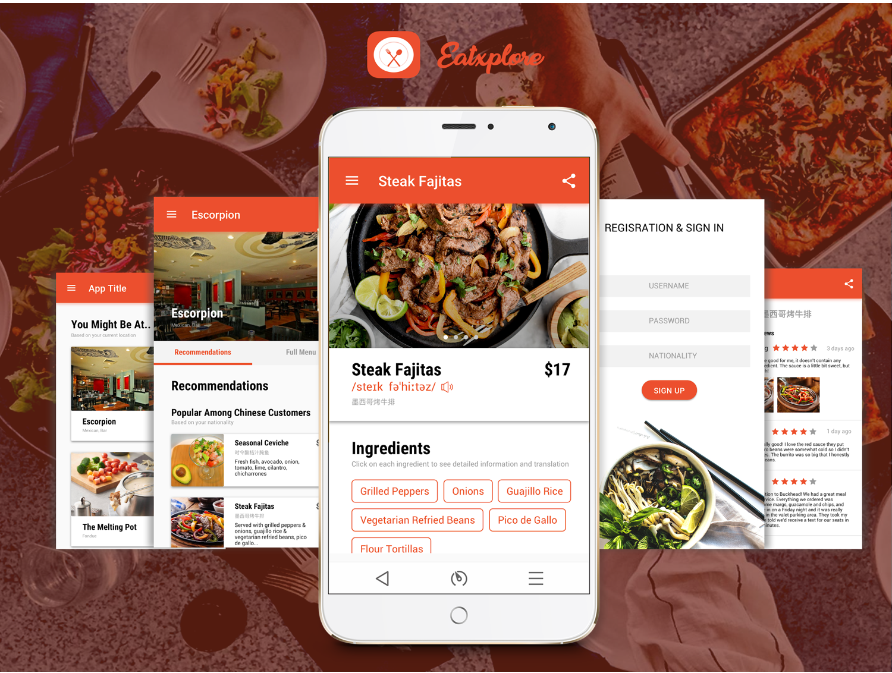
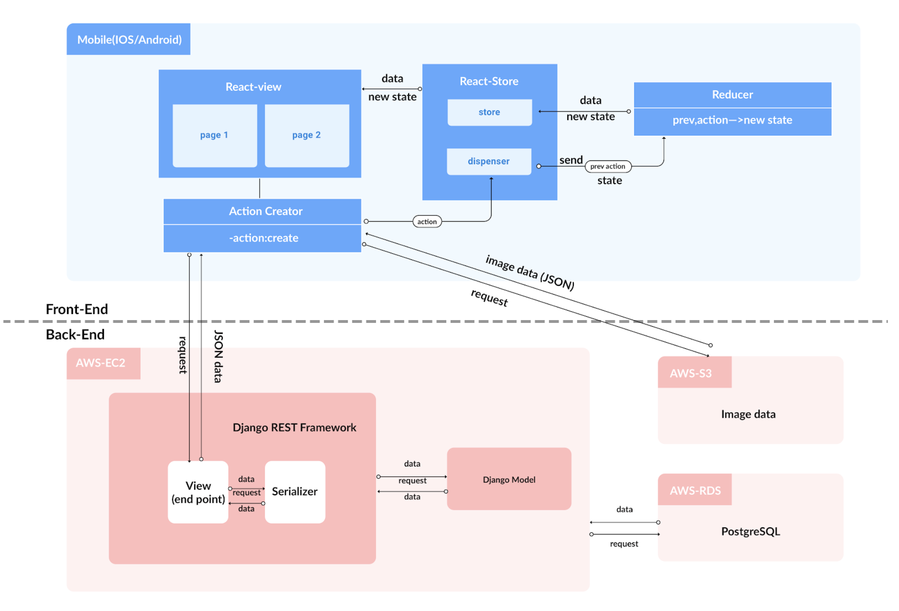

# Eatxplore (Eat and Explore!)

Breaking the Cultural Barriers of Food

## What is Eatxplore?
Eatxplore helps users in foreign restaurants understand the dishes that they are not familiar with. 

Eatsplore is built with __React Native__ and __Django REST Framework__ and is available in __Android__ and __iOS__ applications.

## Features

### Recommendation
Recommendations from people of same or similar background for users who are not familiar with different ethnic dishes. 

### Translation
Translation of dish names and ingredients into users’ native language to help users understand the dish better.

### Matched Reviews
Provide reviews from users of similar background and taste. Reviews have photos and notes.

### Ethnic Group
Provide recommendation and reviews of local ethnic group to help people explore tradtionnal food of different culture.

### Project Video
[Project Video LINK](https://www.youtube.com/watch?v=BhyZdlForc4)

## Architecture

## Report (Product Design)

[Report Link](report.pdf)

## My Role

Tech Lead, Project Lead